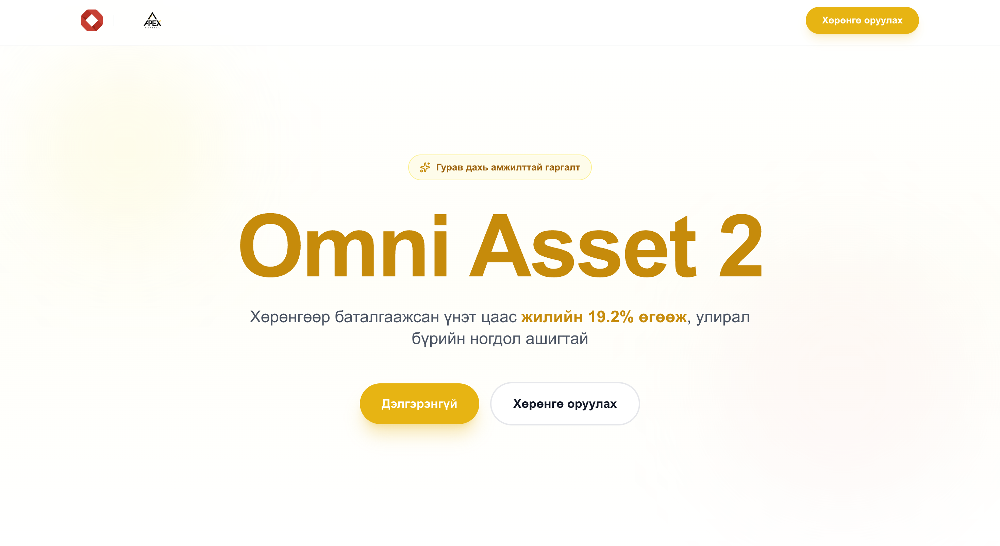

# Omni Asset 2 Landing Page

A premium, high-performance landing page for the Omni Asset 2 investment product, featuring cinematic animations, smooth scrolling, and a fully responsive design.



## 🚀 Features

- **Cinematic Animations**: Powered by **GSAP** and **ScrollTrigger** for immersive storytelling.
- **Smooth Scrolling**: Integrated **Lenis** for a buttery-smooth scroll experience.
- **Universal Sticky Scroll**: A custom sticky scroll implementation that works seamlessly on both desktop and mobile.
- **Responsive Design**: Mobile approach ensuring a perfect experience on all devices.
- **Full Localization**: Complete Mongolian language support (`mn-MN`).
- **Modular Architecture**: Clean, component-based structure using React and TypeScript.
- **Interactive UI**: Rich hover effects, parallax cards, and dynamic data visualizations.

## 🛠️ Technology Stack

- **Framework**: [Next.js 15](https://nextjs.org/) (App Router)
- **Language**: [TypeScript](https://www.typescriptlang.org/)
- **Styling**: [Tailwind CSS](https://tailwindcss.com/)
- **Animations**: [GSAP](https://gsap.com/)
- **Smooth Scroll**: [Lenis](https://lenis.studio/)
- **Icons**: [Lucide React](https://lucide.dev/)

## 📦 Project Setup

### Prerequisites

Ensure you have **Node.js** (v18+) and **Yarn** installed.

### Installation

1. Clone the repository:
   ```bash
   git clone https://github.com/tengisea/apex-omni-landing.git
   cd apex-omni-landing
   ```

2. Install dependencies:
   ```bash
   yarn install
   ```

3. Run the development server:
   ```bash
   yarn dev
   ```

4. Open [http://localhost:3000](http://localhost:3000) in your browser.

## 📸 Screenshots

| Desktop View | Mobile View |
|:---:|:---:|
|  |  |

> *Note: Replace the placeholder images in the `public` folder with actual screenshots of the application.*

## 🏗️ Build & Deploy

To create a production build:

```bash
yarn build
```

To start the production server:

```bash
yarn start
```